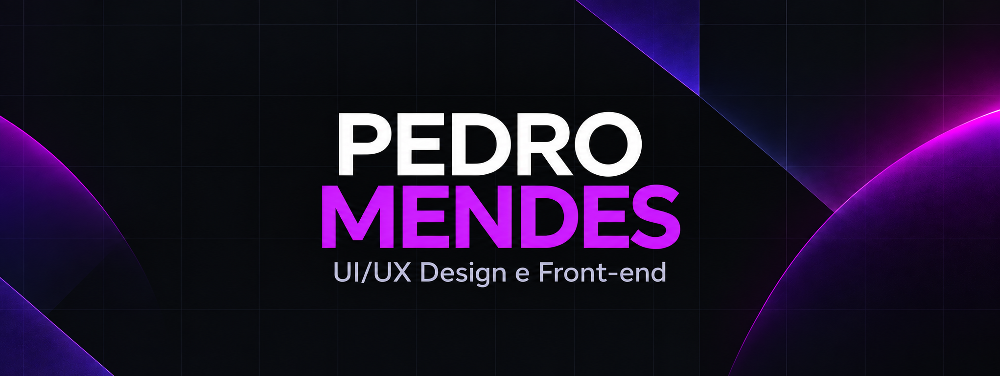

 

I turn strategy into brands, interfaces and websites — from visual direction to front-end implementation.

## About me

I'm a multidisciplinary designer based in Brazil. I work across brand identity, web design, landing pages and product interfaces, always connecting visual decisions to business goals and user needs.

Alongside design, I implement responsive experiences with HTML, CSS, JavaScript, TypeScript, React and Next.js, and publish production-ready projects on Vercel.

- **Design:** visual identity, UI design, responsive layouts and design systems
- **Development:** HTML, CSS, JavaScript, TypeScript, React, Next.js and Tailwind CSS
- **Workflow:** Figma, Git/GitHub, Vercel, Supabase and analytics
- **Interests:** web design, product strategy, project leadership and design-to-code

## Selected projects

| Project | What I delivered | Links |
| --- | --- | --- |
| **English Solution** | Institutional website shaped around the school's brandbook, with a responsive interface, content architecture and conversion-focused pages. | [Case study](https://portfolio-iota-woad-84p4egesbx.vercel.app/projetos/english-solution) · [Code](https://github.com/Pmendes38/english-solution) |
| **Wayzen Client Portal** | Multi-profile product interface for project management and client communication, built with React, TypeScript, Tailwind and Supabase. | [Live project](https://wayzen-client-portal.vercel.app/) · [Code](https://github.com/Pmendes38/Wayzen-Client-Portal) |
| **Interactive Commercial Proposal** | Responsive narrative experience that turns a commercial proposal into an interactive digital presentation. | [Live project](https://propostainterativa.vercel.app/) · [Code](https://github.com/Pmendes38/Proposta-Comercial-Wayzen) |
| **Penrose Strategy Dashboard** | Strategic dashboard for trends, personas, content planning and influencer research. | [Live project](https://dashboard-penrose.vercel.app/) · [Code](https://github.com/Pmendes38/dashboard-penrose) |

## Design case studies

[Wayzen — Brand identity](https://portfolio-iota-woad-84p4egesbx.vercel.app/projetos/wayzen) ·
[Sultec — Brand and institutional website](https://portfolio-iota-woad-84p4egesbx.vercel.app/projetos/sultec) ·
[Thyessa Meira — Personal brand](https://portfolio-iota-woad-84p4egesbx.vercel.app/projetos/thyessa-meira) ·
[Caravana das Frutas — Visual identity](https://portfolio-iota-woad-84p4egesbx.vercel.app/projetos/caravana-das-frutas)

## What I'm looking for

I'm open to remote opportunities in **Web Design, UI Design and Front-end**, especially roles where I can combine strategic thinking, visual craft and hands-on implementation.

**Have a project or opportunity in mind?**  
[Visit my portfolio](https://portfolio-iota-woad-84p4egesbx.vercel.app/) or [connect with me on LinkedIn](https://www.linkedin.com/in/pedromendessouza/).

